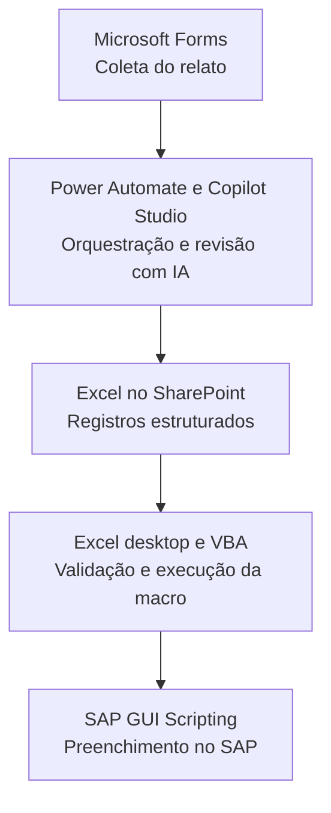

# Digitalização de serviços emergenciais com Power Automate e IA

Projeto de automação de registros de manutenção que conecta Microsoft Forms, Power Automate, Copilot Studio, Excel/SharePoint e SAP GUI Scripting por meio de VBA. A solução estrutura relatos dos executantes e apoia seu lançamento no SAP, com foco na qualidade dos dados e na redução de transcrições manuais.

**Autor:** Eduardo Corrêa Gouvêa  
**Áreas:** automação de processos, inteligência artificial aplicada, gestão de informações e manutenção industrial.

## Sobre este repositório

Este repositório apresenta a arquitetura e as decisões de um projeto desenvolvido em contexto profissional. Seu conteúdo inicial é documental: não inclui código de produção, fluxos exportados, bases corporativas ou um pacote executável. Os exemplos são fictícios, e a descrição não representa uma publicação oficial da empresa.

## Problema

Registros de serviços emergenciais em cadernos exigem transcrição posterior e podem apresentar descrições pouco padronizadas, campos incompletos e dificuldade para identificar pendências. Isso aumenta o trabalho de organização antes do lançamento no sistema de gestão.

O objetivo do projeto foi digitalizar a coleta e organizar as informações desde a origem, preservando o conteúdo técnico informado pelos executantes.

## Arquitetura

O Power Automate coordena o recebimento das respostas, o processamento com IA e a gravação na tabela. A etapa de preenchimento no SAP é executada separadamente por uma macro no Excel desktop, em uma sessão autorizada do SAP GUI. Portanto, não se trata de uma integração direta por API nem de uma automação totalmente executada na nuvem.

## Etapas da solução

1. **Coleta no Forms:** registro do problema inicial, atuação realizada, executantes, horários e situação de conclusão. Quando o serviço não foi finalizado, o formulário solicita o motivo da pendência.
2. **Processamento no Power Automate:** obtenção das respostas e envio das informações para processamento pelo agente no Copilot Studio.
3. **Revisão com IA:** correção de escrita, organização do relato técnico e estruturação de campos para o registro. As instruções orientam a preservar códigos e identificadores, consultar uma base de referência autorizada e sinalizar dúvidas em vez de inventar informações.
4. **Armazenamento no Excel/SharePoint:** organização das respostas em tabela, incluindo descrição, modo de falha, alertas e pendências.
5. **Lançamento com VBA:** validação de campos e preenchimento das telas do SAP GUI conforme a rotina de manutenção.

## Informações estruturadas

| Campo | Finalidade |
| --- | --- |
| Título | Síntese do serviço para identificação do registro |
| Descrição | Consolidação do problema inicial e da atuação realizada |
| Modo de falha | Resumo da falha utilizado no texto breve da operação |
| Alerta da IA | Sinalização de dúvidas ou inconsistências que precisam de conferência |
| Serviço finalizado | Indicação de conclusão em campo booleano |
| Motivo da pendência | Explicação do que permanece em aberto |

## Exemplo fictício

**Problema informado:** “Bomba com vazamento na conexão.”  
**Atuação informada:** “Conexão reapertada e equipamento testado, sem vazamento após o teste.”  
**Descrição organizada:** “Identificado vazamento na conexão da bomba. Realizado reaperto da conexão e teste do equipamento, sem vazamento após o teste.”

A revisão deve melhorar a clareza sem acrescentar diagnósticos, causas ou serviços que não foram informados. O uso de IA não elimina a necessidade de conferência humana.

## Minha contribuição

- Estruturação do formulário e das regras de preenchimento, incluindo perguntas condicionais para pendências.
- Construção do fluxo no Power Automate e configuração das instruções do agente no Copilot Studio.
- Organização da tabela e do mapeamento de campos entre formulário, IA e Excel.
- Desenvolvimento e ajustes da macro VBA com SAP GUI Scripting, incluindo validações e adequação do texto breve da operação.
- Testes do fluxo, tratamento de inconsistências e preparação de orientações para os executantes.

## Benefícios e avaliação

A solução reúne coleta digital, revisão assistida e preparação dos registros para o SAP em um processo estruturado. Os benefícios buscados são menor dependência de transcrição manual, maior padronização das descrições e melhor visibilidade das pendências.

Não são apresentados percentuais de economia ou produtividade sem medição. Indicadores úteis para avaliar o projeto incluem tempo por registro, frequência de correções, completude dos campos e quantidade de lançamentos concluídos sem intervenção adicional.

## Dependências e limites

- A execução depende de permissões, conexões e licenças compatíveis com os recursos utilizados no ambiente Microsoft.
- A macro depende do Excel desktop, do SAP GUI e da autorização para utilização de scripting.
- Alterações nas telas do SAP, nos campos do formulário ou na tabela podem exigir ajustes na automação.
- Alertas da IA e informações ambíguas precisam ser conferidos antes do lançamento.
- Este README descreve a solução; não contém instruções de instalação de um sistema pronto para uso.

## Confidencialidade

Não incluir neste repositório credenciais, tokens, URLs internas, nomes de colaboradores, registros reais, dados de equipamentos ou exportações corporativas sem revisão e autorização. Capturas de tela e exemplos adicionais devem utilizar dados fictícios e não revelar o ambiente da empresa.

A publicação de código, fluxos ou documentação interna depende das autorizações aplicáveis. Esta apresentação não concede permissão para redistribuir materiais corporativos.
