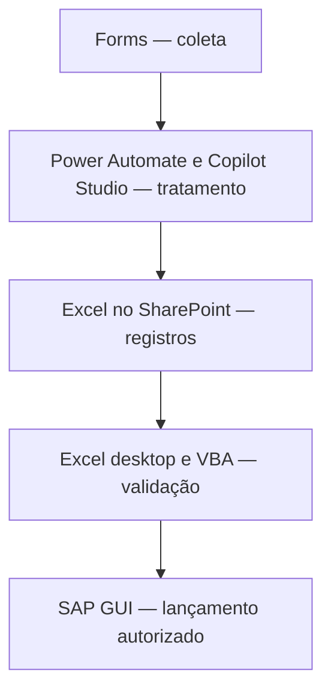

# Serviços emergenciais — demonstração com dados fictícios

Exemplo educacional de processamento de registros de manutenção em Excel/VBA, acompanhado de uma proposta conceitual de automação com Microsoft Forms, Power Automate, Copilot Studio e SAP.

**Este código é um exemplo independente criado para estudo e portfólio. Não é o código de um sistema corporativo, nem uma versão operacional da integração com SAP.** Todos os registros, equipes e retornos da demonstração são fictícios.

## Objetivo

Demonstrar como informações de um serviço podem ser organizadas, validadas e acompanhadas por status antes de um possível lançamento em um sistema de gestão. O exemplo evidencia lógica de programação, manipulação de planilhas, cálculo de duração e tratamento de inconsistências.

## O que está implementado

O módulo [modServicosEmergenciaisDemo.bas](src/modServicosEmergenciaisDemo.bas) cria uma **nova pasta de trabalho** no Excel e:

- Gera cinco registros fictícios, sem ler arquivos ou tabelas corporativas.
- Valida campos obrigatórios, ordem dos horários e motivo de pendência.
- Calcula a duração dos casos válidos, inclusive na passagem da meia-noite.
- Identifica cada caso como `SIMULADO` ou `REJEITADO` e registra o motivo.
- Atribui um identificador `DEMO-LOCAL` aos casos válidos, sem criar ordens reais.
- Organiza os resultados em uma tabela e executa uma autoverificação dos cenários fixos.

Não há conexão com SAP, chamadas de IA, acesso à rede, credenciais ou exportações do Power Automate. A macro não salva arquivos automaticamente e não altera os dados da pasta de trabalho que contém o módulo. Cada execução cria outra pasta de demonstração.

## Arquitetura conceitual

Em uma solução integrada, uma arquitetura possível seria:

**O diagrama representa uma proposta conceitual, não funcionalidades executadas por este repositório.** A demonstração implementa apenas processamento local em Excel/VBA e um retorno fictício. A integração real exigiria desenvolvimento específico, revisão humana, permissões e testes em ambiente autorizado.

## Como executar a demonstração

Requisito: Excel desktop para Windows com suporte a VBA. Excel para a Web não executa esta macro.

1. Baixe `src/modServicosEmergenciaisDemo.bas`.
2. Abra uma pasta de trabalho nova e vazia no Excel desktop.
3. Pressione **Alt + F11** para abrir o editor VBA.
4. No editor, selecione **Arquivo → Importar arquivo** e escolha o `.bas`.
5. Selecione **Depurar → Compilar VBAProject** para verificar a compilação.
6. Volte ao Excel, pressione **Alt + F8**, selecione `ExecutarDemonstracao` e clique em **Executar**.
7. Confira a nova pasta de trabalho, na aba `Demonstracao`.

Execute apenas código que você revisou, respeitando as políticas de macros do seu ambiente; não desative proteções globais do Excel. Para guardar o módulo importado, salve a pasta que o contém como `.xlsm`. A pasta de resultados é separada e pode ser salva como `.xlsx`, se desejar.

## Resultado esperado

| Caso | Cenário fictício | Status esperado | Duração |
| --- | --- | --- | --- |
| CASO-001 | Serviço finalizado | SIMULADO | 1,50 h |
| CASO-002 | Serviço não finalizado, com pendência informada | SIMULADO | 2,00 h |
| CASO-003 | Relato vazio | REJEITADO | Não calculada |
| CASO-004 | Fim anterior ao início | REJEITADO | Não calculada |
| CASO-005 | Serviço atravessando a meia-noite | SIMULADO | 0,50 h |

`SIMULADO` significa que o **registro** passou pela validação local; não significa que o serviço foi finalizado. O segundo caso demonstra essa distinção.

A autoverificação confere as contagens, as durações, as duas mensagens de rejeição e a ausência de retorno nos casos rejeitados. Ela é executada ao rodar a macro e não constitui uma suíte completa de testes.

## Limites e validação

- O exemplo usa entradas internas tipadas e fixas. Não é um importador de dados externos nem um validador completo para uso em produção.
- Não implementa autenticação, persistência, concorrência, integração com IA ou gravação em ERP.
- O módulo recebeu revisão estática durante a preparação, mas **não foi compilado nem executado no Excel neste ambiente**. Os resultados da tabela são expectativas a conferir localmente.
- Nenhum ganho de produtividade medido é atribuído a esta demonstração.

## Portfólio e confidencialidade

Este material foi preparado com apoio de IA para estudo e apresentação de conceitos por Eduardo Corrêa Gouvêa. Não contém a macro corporativa original, nomes de colaboradores, centros de trabalho reais ou instruções específicas do ambiente da empresa.

Não adicione dados internos, capturas de telas corporativas, credenciais ou código do empregador sem autorização. O exemplo independente não deve ser apresentado como a implementação original utilizada no trabalho.
